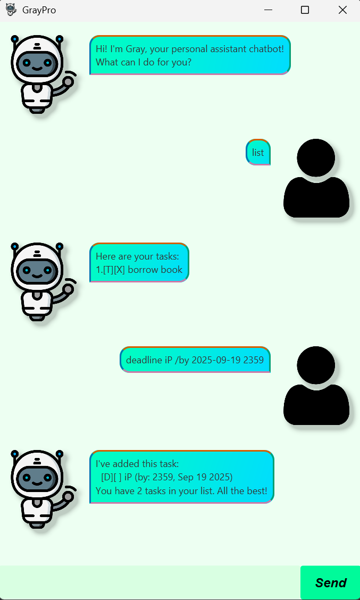

# GrayPro User Guide
GrayPro is a personal assistant chatbot which helps you to track your tasks and manage your busy schedule.

- [Getting Started](#getting-started)
- [Features](#Features)
    - [Listing all tasks: `list`](#listing-all-tasks-list)
    - [Adding a todo: `todo`](#adding-a-todo-todo)
    - [Adding a deadline: `deadline`](#adding-a-deadline-deadline)
    - [Adding an event: `event`](#adding-an-event-event)
    - [Marking a task as done: `mark`](#marking-a-task-as-done-mark)
    - [Marking a task as not done: `unmark`](#marking-a-task-as-not-done-unmark)
    - [Deleting a task: `delete`](#deleting-a-task-delete)
    - [Finding tasks on a certain day: `date`](#finding-tasks-on-a-certain-day-date)
    - [Finding tasks matching a description: `find`](#finding-tasks-matching-a-description-find)
    - [Finding free blocks of time: `free`](#finding-free-blocks-of-time-free)
    - [Exiting the app: `bye`](#exiting-the-app-bye)

## Getting Started
1. Ensure you have Java17 installed.
2. Download the latest .jar file from [here](https://github.com/GREYHAT262/ip/releases).
3. Copy the file to the folder you want to use as the home folder for the chatbot.
4. From a command terminal, `cd` to the folder where the .jar file is and run `java -jar gray.jar`.
5. Refer to the features below for a detailed guide of what the chatbot can do.

## Features
> **NOTE**\
> Words in UPPER_CASE are the parameters to be supplied by the user.

### Listing all tasks: `list`
Shows a list of all the tasks in the order the user added them.\
Format: `list`

### Adding a todo: `todo`
Adds a todo to the list of tasks. Todos are tasks with only descriptions.

Format: `todo DESCRIPTION`
- `DESCRIPTION` is parsed as a string.

Examples:
- `todo borrow book`
- `todo buy chicken rice`

### Adding a deadline: `deadline`
Adds a deadline to the list of tasks. Deadlines are tasks with a due date and time.

Format: `deadline DESCRIPTION /by DUE`
- `DESCRIPTION` is parsed as a string.
- `DUE` must be in the format `yyyy-MM-dd HHmm`.

Examples:
- `deadline return book /by 2025-09-20 1800`
- `deadline submit iP /by 2025-09-19 2359`

### Adding an event: `event`
Adds an event to the list of tasks. Events are tasks with a start date and time and an end date and time.

Format: `event DESCRIPTION /from START /to END`
- `DESCRIPTION` is parsed as a string.
- `START` and `END` must be in the format `yyyy-MM-dd HHmm`.

Examples:
- `event marathon /from 2025-09-20 0800 /to 2025-09-20 1100`
- `event career fair /from 2025-09-22 0900 /to 2025-09-22 1600`

### Marking a task as done: `mark`
Marks a task as done.

Format: `mark INDEX`
- Marks the task at the specified `INDEX`.
- The index refers to the numbering shown by `list`.
- `1 <= INDEX <= n`, where n is the total number of tasks.

Example: `mark 1`

### Marking a task as not done: `unmark`
Marks a task as not done.

Format: `unmark INDEX`
- Unmarks the task at the specified `INDEX`.
- The index refers to the numbering shown by `list`.
- `1 <= INDEX <= n`, where n is the total number of tasks.

Example: `unmark 2`

### Deleting a task: `delete`
Deletes a task from the list of tasks.

Format: `delete INDEX`
- Deletes the task at the specified `INDEX`.
- The index refers to the numbering shown by `list`.
- `1 <= INDEX <= n`, where n is the total number of tasks.

Example: `delete 3`

### Finding tasks on a certain day: `date`
Shows a list of all the tasks occurring on `DATE`.

Format: `date DATE`
- `DATE` must be in the format `yyyy-MM-dd`.

Example: `date 2025-09-12`

### Finding tasks matching a description: `find`
Shows a list of tasks which match `DESCRIPTION`. `DESCRIPTION` is parsed as a string.\
Format: `find DESCRIPTION`\
Examples:
- `find book`
- `find 2345`

### Finding free blocks of time: `free`
Finds the nearest block of time which is of `DURATION` hours.

Format: `free DURATION`
- `DURATION` is parsed as an integer.

Example: `free 5`

### Exiting the app: `bye`
Exits the app.\
Format: `bye`